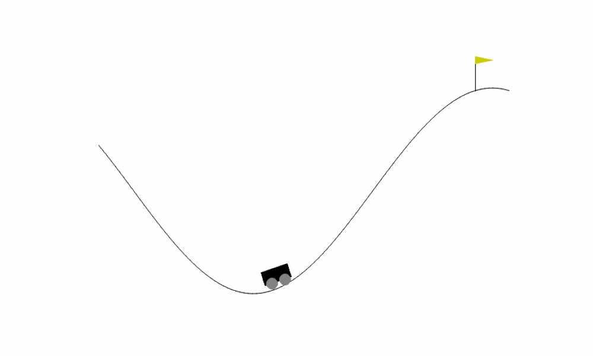

# Solving Continuous Mountain Car Problem using Cross-Entropy Method



### 1. Introduction
In this project, we want to train an agent to learn how to reach to the flag on top of 
the hill. For this purpose, we used policy-based reinforcement learning approach,
where a Cross-Entropy optimization model is applied to find the optimal policy.


### 2. Installation
To install the dependencies, you can use:
```
pip install --upgrade pip
pip install -r requirements.txt
```

### 3. Training
Please follow the instruction in `Navigation.ipynb` to train the agent.


### 4. Visualization
To visualize the agent, you can use:
```
python visualize.py -f FILE_PATH
```

where, `FILE_PATH` is the model's weights for the trained agent. The weights are 
stored in: `saved_model/checkpoint.pth`


